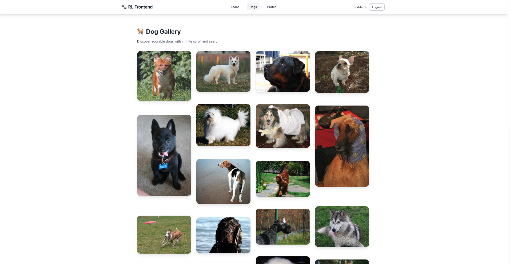
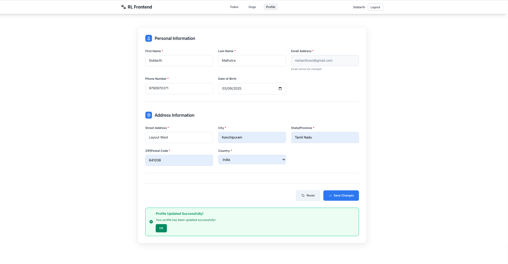

# RL Frontend - Angular Application

A modern Angular 14+ frontend application with three main pages: Todo List, Dog Gallery, and Account Management. Features include infinite scroll, authentication, and a clean blue-themed UI.

## 🚀 Features

### 📝 Todo List Page
- **Infinite Scroll**: Lazy loading with pagination using DummyJSON API
- **Real-time Stats**: Shows loaded todos count and total todos
- **Modern UI**: Clean design with glassmorphism effects


### 🐕 Dog Gallery Page
- **Masonry Layout**: Pinterest-style staggered grid layout
- **Infinite Scroll**: Loads more dogs as you scroll
- **Search Functionality**: Filter dogs by breed or characteristics
- **Shimmer Loading**: Beautiful loading animations for individual cards
- **Hover Effects**: Interactive tooltips and image scaling



### 👤 Account Management Page
- **Three-Column Layout**: Organized form with Personal and Address information
- **Form Validation**: Comprehensive validation with error messages
- **Profile Updates**: Real-time profile updates with optimistic UI
- **TanStack Query-like State Management**: Advanced caching and state management
- **Professional Design**: Clean, business-like interface



### 🔐 Authentication System
- **Login/Register**: Secure authentication with JWT tokens
- **Google OAuth2**: Social login integration
- **Token Management**: Automatic token refresh and logout
- **Route Protection**: Auth guards for protected pages


## 🛠️ Technical Stack

- **Framework**: Angular 14+
- **Styling**: Tailwind CSS with custom components
- **State Management**: Custom Query Service (TanStack Query equivalent)
- **HTTP Client**: Angular HttpClient with interceptors
- **Authentication**: JWT with refresh tokens
- **APIs**: 
  - DummyJSON (Todos)
  - Dog CEO API (Dog images)
  - Custom Backend (Authentication & Profile)

## 📁 Project Structure

```
src/
├── app/
│   ├── components/
│   │   └── navigation/          # Global navigation component
│   ├── pages/
│   │   ├── todo-list/          # Todo list with infinite scroll
│   │   ├── dog-gallery/        # Dog gallery with masonry layout
│   │   ├── account-form/       # Account management form
│   │   ├── login/              # Authentication pages
│   │   └── oauth2-callback/    # OAuth2 redirect handler
│   ├── services/
│   │   ├── auth.service.ts     # Authentication service
│   │   ├── user-profile.service.ts # Profile management
│   │   └── query.service.ts    # State management service
│   ├── guards/
│   │   └── auth.guard.ts       # Route protection
│   └── app.routes.ts           # Application routing
├── styles.css                  # Global styles and Tailwind config
└── polyfills.ts               # Browser compatibility
```

## 🚀 Getting Started

### Prerequisites
- Node.js (v14 or higher)
- npm or yarn
- Angular CLI

### Installation

1. **Clone the repository**
   ```bash
   git clone <repository-url>
   cd rl-frontend
   ```

2. **Install dependencies**
   ```bash
   npm install
   ```

3. **Start the development server**
   ```bash
   npm start
   # or
   ng serve
   ```

4. **Open your browser**
   Navigate to `http://localhost:4200`

## 🔧 Configuration

### Backend APIs
The application connects to the following backend services:

- **Authentication Service**: `http://localhost:8081/api/auth`
- **User Profile Service**: `http://localhost:8082/api/users`

### Environment Variables
The application uses environment files for configuration. Copy `env.example` to create your environment configuration:

```bash
cp env.example .env
```

**Development Environment** (`src/environments/environment.ts`):
```typescript
export const environment = {
  production: false,
  authApiUrl: 'http://localhost:8081/api/auth',
  profileApiUrl: 'http://localhost:8082/api/users',
  dummyJsonApiUrl: 'https://dummyjson.com',
  dogApiUrl: 'https://dog.ceo/api'
};
```

**Production Environment** (`src/environments/environment.prod.ts`):
```typescript
export const environment = {
  production: true,
  authApiUrl: 'https://your-production-auth-api.com/api/auth',
  profileApiUrl: 'https://your-production-profile-api.com/api/users',
  dummyJsonApiUrl: 'https://dummyjson.com',
  dogApiUrl: 'https://dog.ceo/api'
};
```

### Environment Configuration
Update the following URLs in your environment files:

- **AUTH_API_URL**: Authentication service endpoint
- **PROFILE_API_URL**: User profile service endpoint  
- **DUMMY_JSON_API_URL**: DummyJSON API for todos
- **DOG_API_URL**: Dog CEO API for dog images

## 🎨 Design System

### Color Scheme
- **Primary Blue**: `#3b82f6` (blue-500)
- **Hover Blue**: `#2563eb` (blue-600)
- **Background**: `#f8fafc` (slate-50)
- **Text**: `#1e293b` (slate-800)

### Components
- **Glassmorphism**: Backdrop blur effects with transparency
- **Responsive Grid**: Three-column layout on desktop, responsive on mobile
- **Loading States**: Shimmer effects and spinners
- **Form Validation**: Real-time validation with error messages

## 🔐 Authentication Flow

### Login Process
1. User enters credentials
2. API call to `/api/auth/login`
3. JWT tokens stored in localStorage
4. User state updated
5. Redirect to protected pages

### Logout Process
1. API call to `/api/auth/logout` with refresh token
2. Backend invalidates refresh token
3. Local storage cleared
4. User state reset
5. Redirect to login page

### OAuth2 Flow
1. Redirect to Google OAuth2 provider
2. User authorizes application
3. Callback with authorization code
4. Exchange code for tokens
5. Store tokens and update user state

## 📊 State Management

### Query Service
Custom implementation inspired by TanStack Query:

- **Caching**: Automatic data caching with TTL
- **Background Refetching**: Updates stale data
- **Optimistic Updates**: Immediate UI feedback
- **Error Handling**: Automatic retry with exponential backoff
- **Cache Invalidation**: Manual and automatic cache updates

### Usage Example
```typescript
// Get user profile with caching
this.userProfile$ = this.userProfileService.getUserProfile();

// Update profile with optimistic updates
this.userProfileService.updateProfile(data).subscribe({
  next: (result) => console.log('Updated:', result),
  error: (error) => console.error('Error:', error)
});
```

## 🧪 Testing

### Unit Tests
```bash
ng test
```

### E2E Tests
```bash
ng e2e
```

### Linting
```bash
ng lint
```

## 📱 Responsive Design

The application is fully responsive with breakpoints:

- **Desktop**: 3-column layout for forms
- **Tablet** (≤1024px): 2-column layout
- **Mobile** (≤768px): Single column layout

## 🔄 API Integration

### Todo List
- **Endpoint**: `https://dummyjson.com/todos`
- **Features**: Pagination, infinite scroll
- **Data**: Todo items with completion status

### Dog Gallery
- **Endpoint**: `https://dog.ceo/api/breeds/image/random`
- **Features**: Random dog images, search functionality
- **Data**: Dog images with breed information

### User Profile
- **GET**: `/api/users/{userId}` - Fetch user profile
- **PUT**: `/api/users/{userId}/profile` - Update profile
- **Features**: Caching, optimistic updates, retry logic
